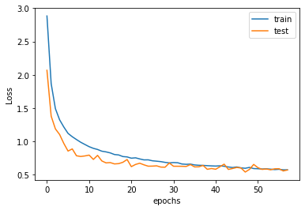

# Speech To Text using 1-D CNN

## Objective :

Speech recognition is invading our lives. It&#39;s built into our phones, our game consoles and our smart watches and it is even automating our homes. Consider the Amazon Echo/Google Home, a magic box that allows you to hear your daily news, order things online and even wake you up in the morning just investing your voice. At the most basic level, speech recognition converts sound waves to individual letters and ultimately sentences. This also shares a wide range of applications that includes education, health care, telephony, transportation and etc. The significance of this project is to research on this Speech-to-text conversion and experiment this awesome technology which we are planning build using the Machine Learning techniques. Image has already taken its root in Machine Learning and grown into a tree in the form of Computer Vision, but speech and voice is one of the greatest things to consider and we took this idea also to learn how convolutional neural networks plays a major role in the recognizing the human voice.

## Techniques :

The process flow will begin from training the model to converting the audio signals to numbers. The model is trained using the TensorFlow speech command dataset which contains around 65000 one second recording of 30 words of varies voices. The data( in our case Audio Signals) should be preprocessed just like the words are preprocessed in the Natural Language Processing, first it is resampled to 8000 Hz since most of the speech frequencies are ~8000 Hz which is then followed by the removing / avoiding the waves which is less than 1 second, these words are treated as glitches or words with no meaning.

As the compiler understands only the numerical, the human readable audio signals should be converted to the Integer where the LabelEncoder is used. This helps in converting the audio signals to number which is then fed into the convolutional neural networks for the fitting the model eventually helps in prediction of words. As the classification of words involves multi-classification, one-hot encoding/vectorization is followed. So, because of this multi-classification problem the loss function should be categorical cross-entropy.

Followed by this, the best model should be captured so the model is trained for each epochs and the best model is classified based on the perfect epoch the model is being trained, so in order to do achieve this the EarlyStopping and the modelCheckPoint are used. The best model chosen from number of epochs is being fit for the prediction. Then, the max is being chosen from the 3D matrix using argmax() function and it is run for the several sample with the sampling frequency of 8000Hz.

The final phase is testing the predicted model using the input samples of voice. The voice which is being received by the system is converted to the text and is resampled for the desired frequency. Then, this is being passed to the predict function and the result is obtained.

## Tools :

1. **Jypter** - Chosen as the developing environment, as the training and the testing dataset is huge in size, Jupyter helped to process the larger number of samples(.wav)
1. **Libraries** - OS, LibROSA, Keras, numpy, scipy , matplotlib, sklearn, random, sounddevice, soundfile
  1. **Os** - to read the files inside the folder and to iterate on each .wav
  1. **LibROSA** - LibROSA is a python package for music and audio analysis. It provides the building blocks necessary to create music information retrieval systems. Also helps in loading the audio files
  1. **Keras** - This is one of the important feature/library used in this project, this helps in convolutional neural network which greatly helps in the prediction and analysis.
  1. **Numpy** - This is majorly used for the computation purposes, some computations will easily be calculated if it is viewed in the form of the array (1D,2D or 3D)
  1. **Scipy** - This is used to process the audio files along with the LibROSA.
  1. **matplotlib** - Several data visualisations has been done in order for the data analytics of the audio files. This greatly helps to classify the process and to perform the neural network functionalities.
  1. **Sklearn** - This library is widely used for the modelling the training dataset and after which the prediction can be performed for the user&#39;s audio signals.
  1. **Random** - To pick the random integer
  1. **sounddevice** - This library helps in recording of the input voice from the users/humans through which the system performs the prediction process.
  1. **soundfile** - After the audio signals are inputted from the users, this library helps in writing the data(audio) to the file just like fileStreams which writes text data. In our case audio signals are taken.

## Results :

Fig 1. Number of audio files for each word, represented using the matPlotLib

Fig 2. Sampling the audio signal of a particular word

Fig 3. Time distribution of the audio signals

Fig 4. Epoch v/s the loss in the model

The model ran for 58 epochs and we achieved an **accuracy of around 82.95 %**. We started with a logarithmic loss of 2.58 and ended up with 0.5.

## Conclusion :

The speech recognition (prediction of words) for the speech command dataset is done using the Machine Learning libraries listed above in the &#39;Tools&#39;. Looking through the video, our model predicts the words/commands being delivered by the humans which helps the machine understand and performs a task. As discussed in the objective/introduction this system can widely be used in variety of fields where man-power is less needed. This system what we developed serves as the fundamentals of advanced Voice assistant powered by AI technologies, the work also fascinates us to explore this amazing machine in detail and it was a fun to learn the Audio processed technology built using Machine Learning tools and techniques.

## References :

1. https://towardsdatascience.com/hello-world-in-speech-recognition-b2f43b6c5871
2. https://towardsdatascience.com/easy-speech-to-text-with-python-3df0d973b426
3. https://medium.com/@rahulvaish/speech-to-text-python-77b510f06de
4. https://medium.com/analytics-vidhya/speech-recognition-using-python-bafe550ee6e9
5. https://www.rev.com/blog/artificial-intelligence-machine-learning-speech-recognition